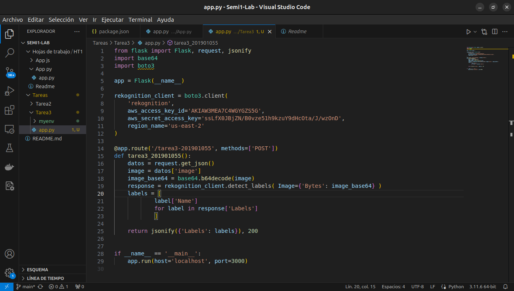
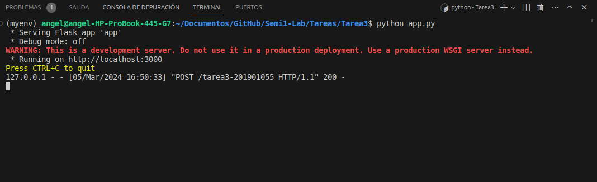
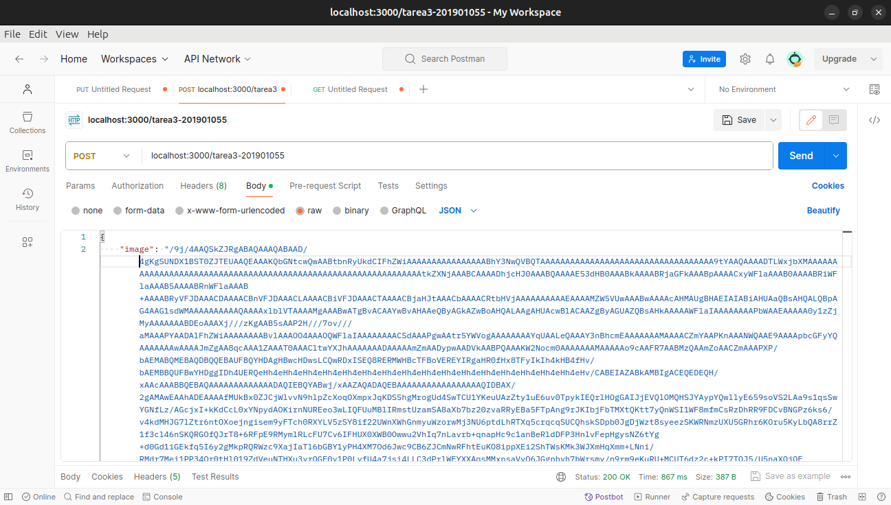
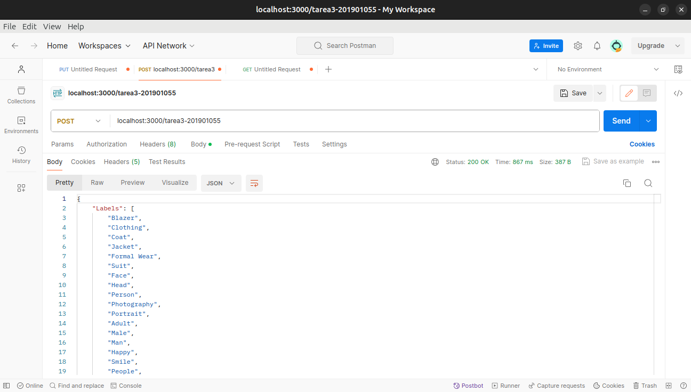

___
**Tarea 3**
___
***Descripcion***  
Realizar un servidor en Python, puede ser local o en una máquina virtual en el que
solo se cree una ruta llamada /tarea3-carne en el cual por medio de un Json ingresen
1 imagen en base64 para que pueda ser enviada a Rekognition con el SDK para
Python(boto3) en el cual les devuelva la lista de etiquetas para la foto que se ingrese.
En base a lo anterior realizar las siguientes capturas y adjuntarlas a un pdf
(Únicamente esas capturas no excederse de más de 5 paginas):

• Capturas del código del servidor.

• Captura del servidor corriendo.

• Captura del Json ingresado y ruta creada (Postman).

• Imagen que se ingresó a analizar.

• Captura de las etiquetas devueltas por Rekognition.

