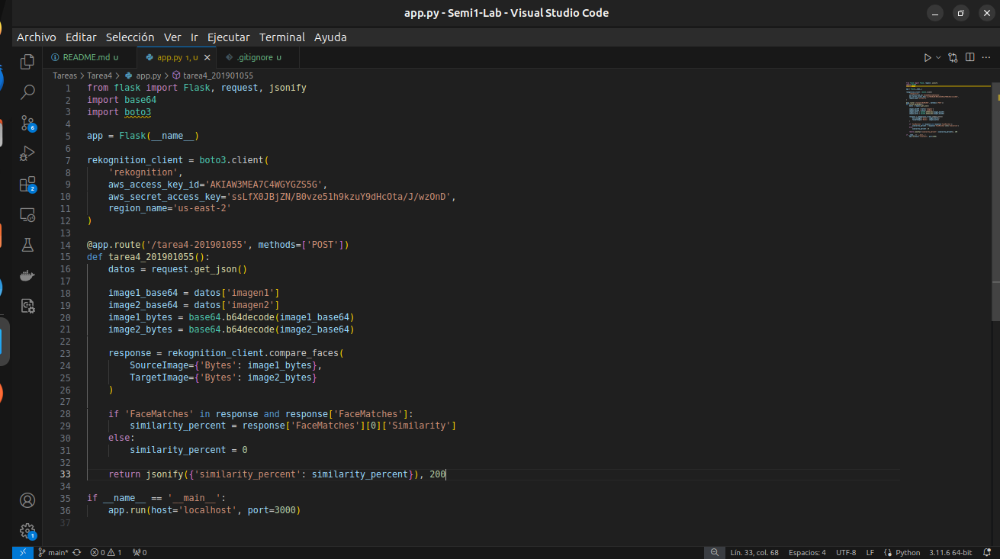
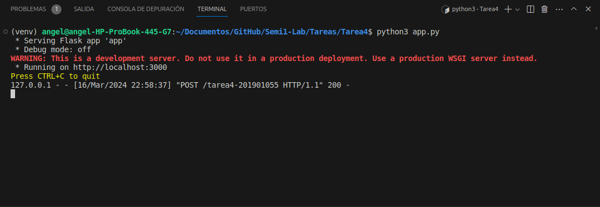
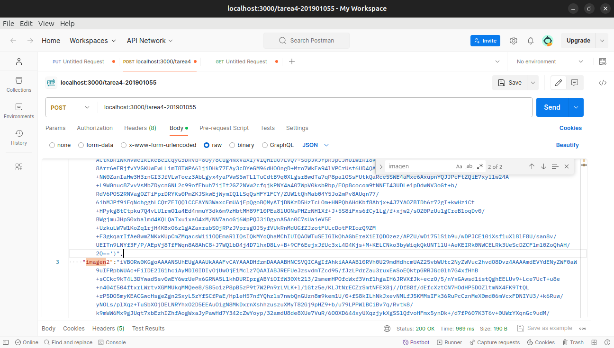
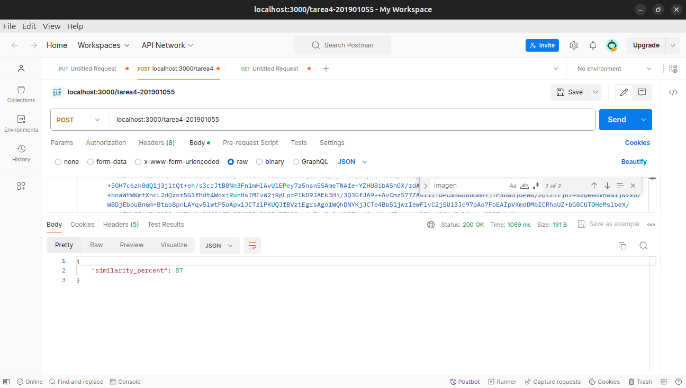

___
**Tarea 3**
___
***Descripcion***  
Realizar un servidor en Python, puede ser local o en una máquina
virtual en el que solo se cree una ruta llamada /tarea4-carne en el
cual por medio de un Json ingresen 2 imagenes en base64 para que
pueda ser enviada a Rekognition con el SDK para Python(boto3) en
el cual les devuelva el porcentaje de parentesco para las fotos que
se ingresen.

***Capturas***  
• Capturas del código del servidor.

• Captura del servidor corriendo.

• Captura del Json ingresado y ruta creada (Postman).

• Imagen que se ingresó a analizar.

• Captura de las etiquetas devueltas por Rekognition.

